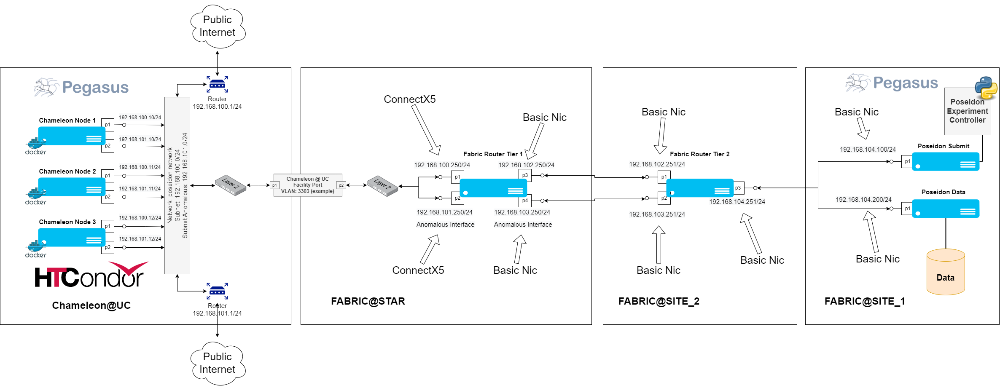
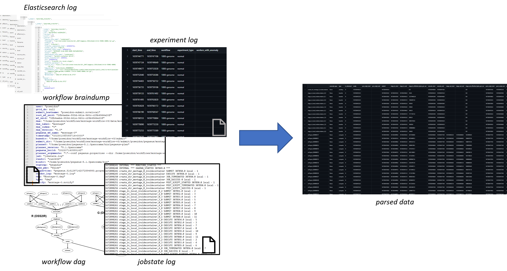

# FlowBench Raw Data Archive

To generate the raw logs, we provisioned resources at the [NSF Chameleon Cloud](https://www.chameleoncloud.org/) 
and the [FABRIC Testbed](https://fabric-testbed.org/). We provisioned 4 VMs (16 Cores and 32GB RAM) on FABRIC and 3 Cascade
Lake bare-metal nodes (48 Cores and 192GB RAM) on Chameleon. In FABRIC 1 had the role of submit node, 1 had the role of data node
and 2 were responsible for network QoS to the workers (StarLight location). In Chameleon all nodes were Docker container executor
nodes [Docker Inc., 2022] located in the same region (University of Chicago - UC). The connectivity between the two testbeds/regions
was established over a high-speed layer 2 VLAN (25 Gbps)

<p align="center">

</p>

In the raw data you can find:
- *workflows.tar.xz*: the workflows and the configurations used to execute them.
- *experiments.csv*: the log that correlates a DAG execution with the infrastructure conditions, that helps label the data.
- *archive/workflow-submit-dirs.tar.xz.partX*: the workflow submit directories of all DAG executions, containing workflow management system logs, and provenance data.
- *archive/elasticsearch.tar.xz.partX*: an elasticsearch with the captured workflow events, transfer events and resource utilization traces.


## Parsing the raw data

To generate the parsed data invoke the the following command:

```
bash run_parser.sh
```

To parser depends on **Docker** and **Docker Compose**, since elasticsearch runs in a container. Total space requirement on disk is 300GB.<br>
`run_parser.sh` untars the tar.xz files, creates a python environment with the needed packages, starts up the elasticsearch instance and goes through the workflow submit directories 
to generated the parsed data. The parsed data will be saved in the ./output folder. For a detailed description of the events and logs please refer to [Pegasus' Documentation](https://pegasus.isi.edu/documentation/reference-guide/monitoring.html?highlight=events).

<p align="center">

</p>
